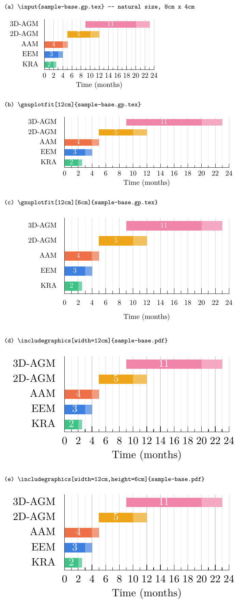
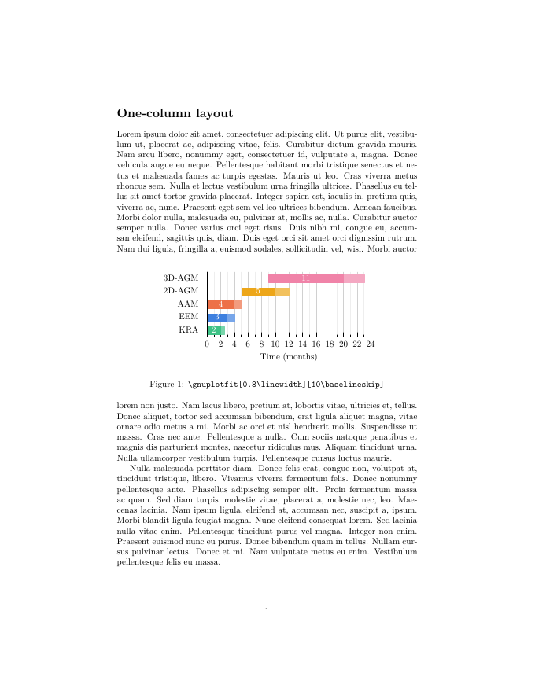
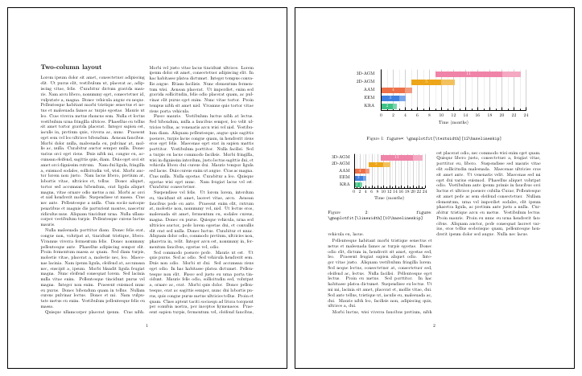

# 101: sizing a figure in LaTeX

You have a figure as `NAME.gp.tex`, made by `make` from `NAME.csvy`. This
tutorial covers how to put it in a document at the size you want, and why
that differs from an ordinary image.

## What a `.gp.tex` file is

`NAME.gp.tex` is a TikZ picture written by gnuplot's `tikz` terminal. It
isn't an image: it's LaTeX code that draws the bars, lines and text while
your document compiles. That has two consequences:

- **Text is typeset by LaTeX,** in the document's font and size, and labels
  can contain LaTeX (`\textbf{…}`, `$t$`).
- **Coordinates have no units,** so the drawing can be stretched while the
  text stays put. That's what `\gnuplotfit` does.

It needs one package:

```latex
\usepackage{gnuplotfit}   % loads gnuplot-lua-tikz, which loads TikZ
```

## Natural size

Every figure has a *natural size*, set in its `.csvy` under `vars:` as
`fig: {w, h}` (in cm). The Gantt template's default is 8 cm × 4 cm.
`\input` places the figure at exactly that size:

```latex
\input{sample-base.gp.tex}
```


## `\gnuplotfit`: stretch the drawing, keep the text

```latex
\gnuplotfit[<width>][<height>]{<file>}
```

| Argument | Default | Accepts |
|---|---|---|
| `<width>` | `\linewidth` | any length: `\columnwidth`, `0.9\textwidth`, `12cm`, … |
| `<height>` | natural height | any length: `10\baselineskip`, `6cm`, … |

It measures the figure at its natural size, then stretches it so the result
is exactly `<width>` × `<height>`. Only the drawing is stretched; every label
keeps its normal size.

## Compared with `\includegraphics`

`\includegraphics` scales a finished picture (a PDF or PNG), text and all. To
compare the two, `101-natural` above was also saved as a PDF and included
both ways. Panels (b) and (d) request the same width, as do (c) and (e):



| | `\gnuplotfit` | `\includegraphics` |
|---|---|---|
| Text size | always the document's size: (b), (c) | scaled with the figure: (d) is 1.5× larger than the body text |
| Width only | stretches horizontally; height stays natural: (b) | scales both ways to keep the aspect ratio: (d) grows to 6 cm tall |
| Width and height | stretches the drawing to fit; text keeps its shape: (c) | stretches everything, text included: (e); `keepaspectratio` avoids that but no longer fills both |
| Font | the document's, and it follows any change to it | whatever it was when the PDF was made |
| Input | `NAME.gp.tex` (TikZ code) | a PDF or PNG |
| Shrinking below natural size | text stays full-size and may overlap: avoid it | works, text shrinks |

`\resizebox` and `\scalebox` behave like `\includegraphics` here: they scale
the text too.

**Rule of thumb:** make the natural size (`fig`) about the smallest size
you'll use, then only ever stretch it.

## One-column layout

In a one-column document, `\linewidth` is the text width. Here the figure
takes 80 % of it, with a height of ten text lines:

```latex
\begin{figure}[h]\centering
  \gnuplotfit[0.8\linewidth][10\baselineskip]{sample-base.gp.tex}
  \caption{...}
\end{figure}
```



Giving the height in `\baselineskip` units ties it to the text: ten lines of
figure take the space of ten lines of text.

## Two-column layout

In a two-column document, `\linewidth` inside `figure` is the column width,
and inside `figure*` it is the full text width, so the default width already
does the right thing. The example spells both out:

```latex
\begin{figure*}[t]\centering      % spans both columns
  \gnuplotfit[\textwidth][12\baselineskip]{sample-base.gp.tex}
  \caption{...}
\end{figure*}

\begin{figure}[t]\centering       % one column
  \gnuplotfit[\linewidth][10\baselineskip]{sample-base.gp.tex}
  \caption{...}
\end{figure}
```



Both figures are defined on page 1 but appear on page 2. That's standard
LaTeX float behaviour, not something `\gnuplotfit` does:

- **A `figure*` never appears on the page where it's defined.** It goes to
  the top of a later page.
- **Floats keep their order.** The column figure was defined after the
  `figure*`, so it can't appear before it.

Both figures come from the same file at different sizes. Nothing was
regenerated.

## Summary

- **Put a figure in:** `\gnuplotfit[<width>][<height>]{NAME.gp.tex}`, with
  width defaulting to `\linewidth` and height to the natural height.
- **Only stretch:** set `vars: {fig: {w, h}}` in the `.csvy` to about the
  smallest size you need.
- **When to use `\includegraphics`:** only when you *want* the text to scale
  with the figure.

Next: [a sample Gantt chart](sample-gantt-chart.md), where the figure comes
from.
