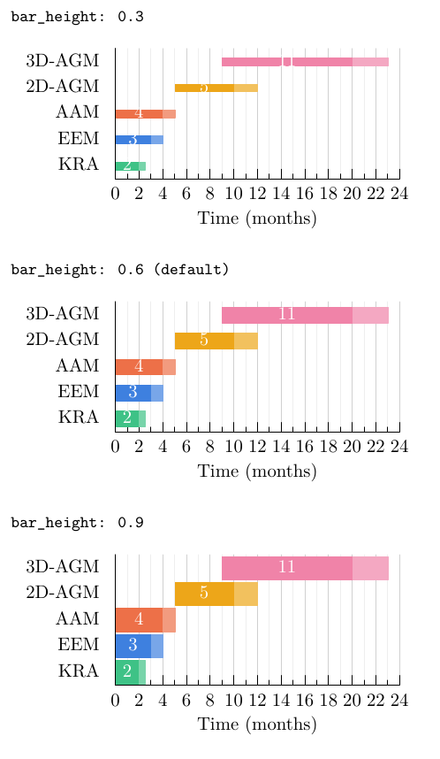
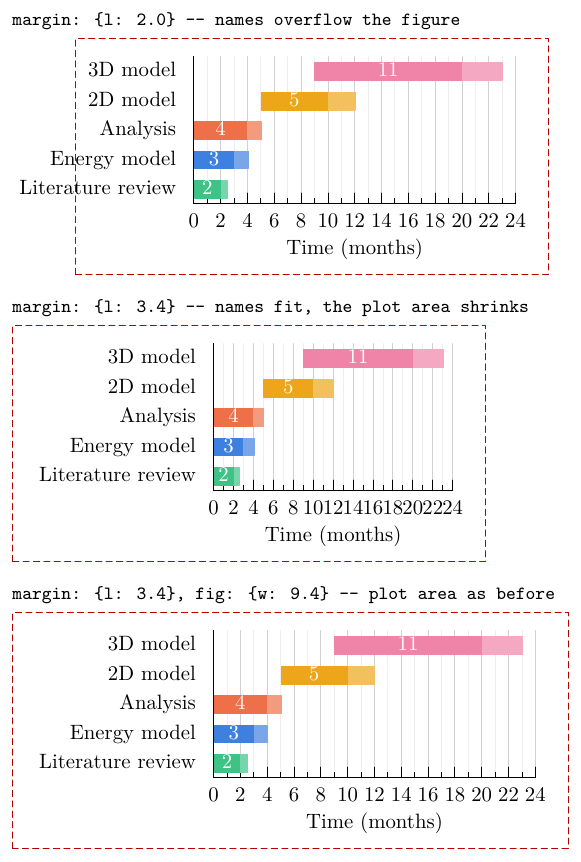
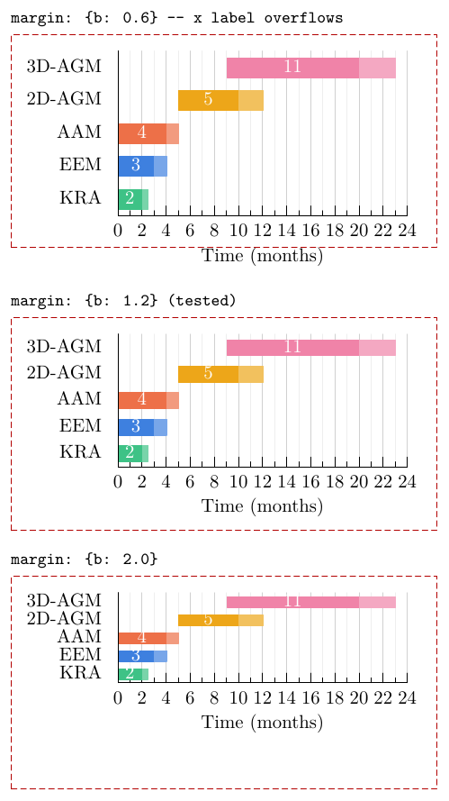
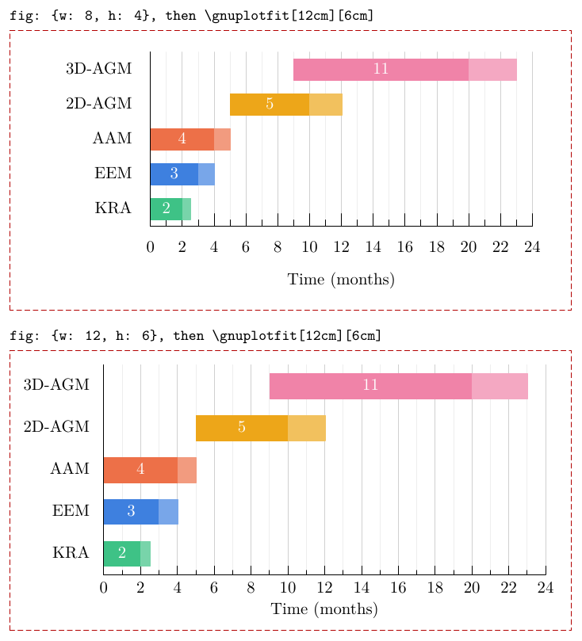
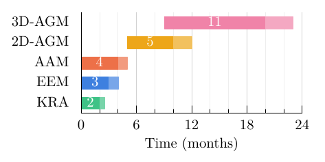
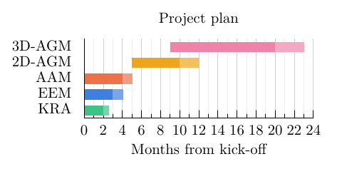
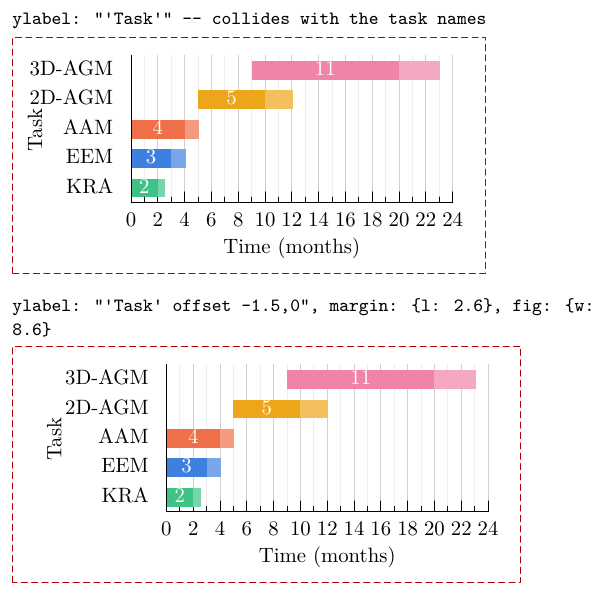

# Advanced Gantt chart

The [sample tutorial](sample-gantt-chart.md) changed the data. This one keeps
the data and changes the settings: bar thickness, the gutters (margins)
around the plot, the natural size, the grid and the labels.

Every example is `sample-base.csvy` with only the lines shown changed. The
dashed red frame marks the size the figure was asked to fill; anything
outside it is overflow.

## Two kinds of setting: `vars` and `gnuplot`

A `.csvy` header has two sections. Each is applied over the template's
defaults in `templates/gantt.csvy`, key by key, so you only write what
changes:

| Section | Becomes | Used for |
|---|---|---|
| `vars:` | gnuplot *variables* | the values `gantt.gp` calculates with |
| `gnuplot:` | `set <key> <value>` lines, run before `gantt.gp` | everything else: labels, grid, border, tics, key, … |

**`vars`:** nested keys are joined with `_`, so these two forms give
identical figures (checked byte for byte):

```yaml
vars:                                 vars:
  t: {end: 24.0, grid: 2.0}             t_end: 24.0
                                        t_grid: 2.0
```

[`examples/adv-flat.csvy`](../examples/adv-flat.csvy) is the flat form. A
nested override only changes what it names: `margin: {l: 3.4}` keeps the
default `margin_b`.

The Gantt template's vars are `t: {start, end, grid}`, `fig: {w, h}`,
`margin: {l, b}`, `bar_height` and `show_text`. Their defaults and units are
in the [reference](../REFERENCE.md#template-templatesgantt).

A misspelt var, such as `bar_hieght`, stops the build with "unknown var".
The template only understands the vars in its defaults file, plus `t_end`,
which it checks for itself.

**`gnuplot`:** any gnuplot setting, written as-is. The template's defaults
set the x label, minor ticks, grid, border, tics and key; see
`templates/gantt.csvy` (shown in the
[sample tutorial](sample-gantt-chart.md)). Settings that aren't in the
defaults work too, e.g. `title`, `ylabel`,
`label 1`, `arrow 1`. The exceptions are `terminal`, `output`, `datafile`
and `table`, which the template and `inp2gp` need to control.

**Which wins:** the `gnuplot:` lines run first, then the template. If the
template sets something from a var, the var wins. For example, the x range
always comes from `t`, so a `gnuplot: {xrange: …}` entry has no effect. The
full merging rules are in the
[reference](../REFERENCE.md#generator-inp2gppy).

## Anatomy of the figure

With the tested settings, measured from the generated TikZ:

```
 ┌──────────────────────── fig_w = 8.0 cm ───────────────────────┐
 │            top gutter 0.31 cm (automatic)                      │
 │           ┌──────────── plot area 5.45 cm ─────────┐           │
 │  3D-AGM   │              ▆▆▆▆▆▆▆▆▆▆▆▆▆▆▒▒▒▒▒        │           │
 │  2D-AGM   │       ▆▆▆▆▆▆▆▒▒▒                 row    │  right    │  fig_h
 │  AAM      │▆▆▆▆▆▒                            pitch  │  gutter   │  = 4.0 cm
 │  EEM      │▆▆▆▒                              0.50cm │  0.55 cm  │
 │  KRA      │▆▆▒                                      │ (auto)    │
 │           └─────────────────────────────────────────┘           │
 │ margin_l    0  2  4  6 …                     24                 │
 │ = 2.0 cm          Time (months)          margin_b = 1.2 cm      │
 └────────────────────────────────────────────────────────────────┘
```

- **Plot area:** the figure minus the gutters. Here it's 8.0 − 2.0 − 0.55 =
  5.45 cm wide and 4.0 − 1.2 − 0.31 = 2.49 cm tall.
- **Row pitch:** the plot height divided by the number of rows. Here it's
  2.49 / 5 = 0.50 cm.
- **Bar thickness:** `bar_height` × the row pitch, here 0.6 × 0.50 = 0.30 cm.
  The gap between bars is the remaining 0.20 cm.

So the thickness of a bar depends on `bar_height`, `fig_h`, `margin_b` and
the number of rows. The left and bottom gutters are yours to set, through
`vars`. gnuplot sets the top and right ones itself, to fit the last tick
label and the title.

## Bar thickness: `bar_height`

```diff
 vars:
+  bar_height: 0.3        # or 0.9; the default is 0.6
   t: {end: 24.0, grid: 2.0}
```

[`adv-bar-03.csvy`](../examples/adv-bar-03.csvy),
[`adv-bar-09.csvy`](../examples/adv-bar-09.csvy)



| `bar_height` | Bar | Gap between bars |
|---|---|---|
| 0.3 | 0.15 cm | 0.35 cm |
| 0.6 | 0.30 cm | 0.20 cm |
| 0.9 | 0.45 cm | 0.05 cm |

Nothing else moves: the plot area and row pitch stay the same. The duration
numbers are white, and at 0.3 they're taller than the bars, so the parts
outside the bars disappear against the background. With thin bars, set
`show_text: false`.

## Left gutter: `margin: {l}` / `margin_l`

The left gutter holds the task names. gnuplot can't measure LaTeX text, so
this width is fixed rather than guessed. Longer names need more room.
Relabel the tasks:

```diff
-1,0.0,2.0,#29bb78,0.5,#69cfa1,KRA
+1,0.0,2.0,#29bb78,0.5,#69cfa1,Literature review
 ...                                              (and the other four)
```

[`adv-margin-l-20.csvy`](../examples/adv-margin-l-20.csvy),
[`adv-margin-l-34.csvy`](../examples/adv-margin-l-34.csvy),
[`adv-margin-l-34-w94.csvy`](../examples/adv-margin-l-34-w94.csvy)



1. **`margin: {l: 2.0}`:** "Literature review" is about 2.7 cm wide and
   sticks out of the figure. In a document, the figure would be wider than
   you asked for and could hit the page margin.
2. **`margin: {l: 3.4}`:** the names fit, but the gutter takes the extra
   1.4 cm from the plot area (5.45 → 4.05 cm), and the axis numbers run
   together.
3. **`margin: {l: 3.4}` + `fig: {w: 9.4}`:** add the same 1.4 cm to the
   width. The plot area is back to 5.45 cm.

```diff
 vars:
+  margin: {l: 3.4}
+  fig: {w: 9.4}
   t: {end: 24.0, grid: 2.0}
```

`\gnuplotfit` can then stretch it to any width from 9.4 cm up.

## Bottom gutter: `margin: {b}` / `margin_b`

The bottom gutter holds the tick numbers and the x-axis label.

```diff
 vars:
+  margin: {b: 0.6}        # or b: 2.0; the default is 1.2
   t: {end: 24.0, grid: 2.0}
```

[`adv-margin-b-06.csvy`](../examples/adv-margin-b-06.csvy),
[`adv-margin-b-20.csvy`](../examples/adv-margin-b-20.csvy)



| `margin.b` | Plot height | Row pitch | Bar (at 0.6) | Result |
|---|---|---|---|---|
| 0.6 | 3.09 cm | 0.62 cm | 0.37 cm | "Time (months)" crosses the bottom edge |
| 1.2 | 2.49 cm | 0.50 cm | 0.30 cm | fits: the tested value |
| 2.0 | 1.69 cm | 0.34 cm | 0.20 cm | fits, with 0.8 cm of empty space |

The gutter takes its height from the plot, so a bigger bottom gutter also
means thinner bars. 1.2 cm fits one row of tick numbers plus a one-line label.

## Natural size: `fig: {w, h}` / `fig_w`, `fig_h`

`\gnuplotfit` stretches everything except the text, *including the gutters*.
Compare two ways to get a 12 cm × 6 cm figure:

```diff
 vars:
+  fig: {w: 12.0, h: 6.0}
   t: {end: 24.0, grid: 2.0}
```

[`adv-fig-12x6.csvy`](../examples/adv-fig-12x6.csvy); both are placed with
`\gnuplotfit[12cm][6cm]`.



| | Natural 8 × 4, stretched ×1.5 | Natural 12 × 6 |
|---|---|---|
| Left / bottom gutter | 3.0 cm / 1.8 cm (stretched) | 2.0 cm / 1.2 cm (as set) |
| Plot area | 8.2 cm × 3.7 cm | 9.4 cm × 4.5 cm |
| Bar | 0.45 cm | 0.54 cm |

The gutters only need to hold text, and text doesn't grow when the figure
does. Stretching a small figure a lot therefore wastes space in the
gutters. For a figure that will always be large, raise `fig` to near that
size, and keep `\gnuplotfit` for small adjustments. The same goes for adding
many rows: raise `fig.h` rather than letting the bars get thin.

## Grid: `t: {grid}` and `mxtics`

```diff
 vars:
-  t: {end: 24.0, grid: 2.0}
+  t: {end: 24.0, grid: 6.0}
 gnuplot:
   xlabel: "'Time (months)'"
-  mxtics: 2
+  mxtics: 3
```

[`adv-grid.csvy`](../examples/adv-grid.csvy)



- **`t: {grid}`** (a var) is the spacing of the labelled ticks and the
  darker grid lines.
- **`mxtics`** (a gnuplot setting) is the number of *intervals* between
  them, so `mxtics: 3` draws two lighter lines, one every 2 months here, and
  `mxtics: 1` draws none.

Choose `grid` so that the numbers don't collide. At the natural width of
8 cm, about 13 labels fit.

## Labels: `title`, `xlabel`, `show_text`

```diff
 vars:
+  show_text: false
   t: {end: 24.0, grid: 2.0}
 gnuplot:
+  title: "'Project plan'"
-  xlabel: "'Time (months)'"
+  xlabel: "'Months from kick-off'"
   mxtics: 2
```

[`adv-labels.csvy`](../examples/adv-labels.csvy)



- **The title takes its height from the plot:** gnuplot enlarges the top
  gutter automatically, so the rows get thinner, as with `margin.b`: here
  the plot height drops from 2.49 cm to 1.88 cm. In a paper, the figure's
  `\caption` usually replaces the title, so the template sets none.
- **Labels are gnuplot strings:** write gnuplot's single quotes inside
  YAML's (`"'Project plan'"`). For LaTeX with backslashes, use a `>-`
  block, as shown in the
  [sample tutorial](sample-gantt-chart.md) under *Writing labels*.

## y-axis label: `ylabel` with an offset

gnuplot places `ylabel` beside the task names, using its own estimate of
their width, which is too narrow for LaTeX text, so the two overlap.
`ylabel` is an ordinary gnuplot setting, so gnuplot's `offset` option can
move it left, in character widths. Give it room with `margin.l`, and widen
`fig.w` by the same amount to keep the plot area:

```diff
 vars:
+  margin: {l: 2.6}
+  fig: {w: 8.6}
   t: {end: 24.0, grid: 2.0}
 gnuplot:
+  ylabel: "'Task' offset -1.5,0"
   xlabel: "'Time (months)'"
```

[`adv-ylabel-plain.csvy`](../examples/adv-ylabel-plain.csvy),
[`adv-ylabel-fixed.csvy`](../examples/adv-ylabel-fixed.csvy)



The right offset depends on your longest task name. Check the result, and
keep the label inside the dashed frame.

## Summary

| To… | Change |
|---|---|
| make bars thicker or thinner | `bar_height` (0–1) |
| fit longer task names | `margin.l`, and `fig.w` by the same amount to keep the plot area |
| make room for bigger axis text | `margin.b` |
| keep gutters tight in a large figure | raise `fig: {w, h}` rather than stretching a lot |
| fit many rows | raise `fig.h` |
| thin out the axis numbers | `t.grid` (vars), `mxtics` (gnuplot) |
| let the axis follow the data | remove `t.end` |
| add a title or axis label | `title`, `xlabel`, `ylabel` (gnuplot; `ylabel` with an `offset`) |
| change any other gnuplot setting | add it under `gnuplot:` |
