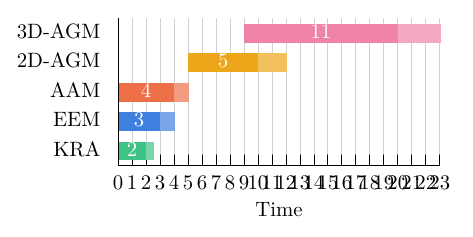
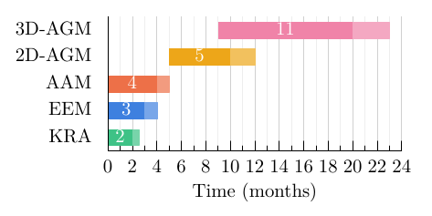
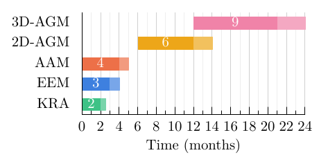
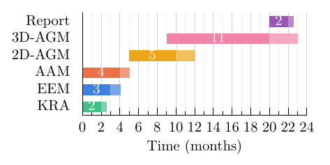
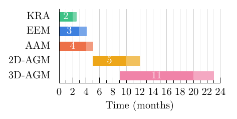
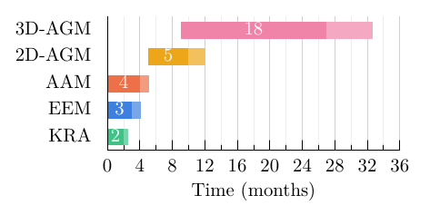

# A sample Gantt chart

This tutorial builds a Gantt chart from a CSV table, first with only the
defaults and then with the tested settings. It then edits the data (never
the settings) to show how the chart follows.

Each task is drawn as a bar from `Start` to `End`, followed by a lighter
*buffer* bar of length `Buffer`: slack in case the task overruns.

## 1. The input file

A `.csvy` file is YAML settings between `---` lines, then a CSV table. The
smallest useful one names the template and gives the data:

```
---
template: templates/gantt
---
Index,Start,End,Color,Buffer,BufferColor,Label
1,0.0,2.0,#29bb78,0.5,#69cfa1,KRA
2,0.0,3.0,#2972db,1.0,#699ce6,EEM
3,0.0,4.0,#eb6034,1.0,#f19071,AAM
4,5.0,10.0,#eb9c00,2.0,#f1ba4c,2D-AGM
5,9.0,20.0,#ee759e,3.0,#f39ebb,3D-AGM
```

[`examples/sample-minimal.csvy`](../examples/sample-minimal.csvy)

`template: templates/gantt` names two files:

- **`templates/gantt.gp`:** the gnuplot script that draws the chart.
- **`templates/gantt.csvy`:** the template's defaults, a header with no data.

| Column | Meaning |
|---|---|
| `Index` | the row: 1 at the bottom, counting up |
| `Start`, `End` | the task bar, in any time unit |
| `Color` | the task's colour, `#rrggbb` |
| `Buffer` | the buffer's length, drawn from `End` to `End + Buffer` |
| `BufferColor` | the buffer's colour, `#rrggbb` |
| `Label` | the task's name; LaTeX is allowed |

Save it as `schedule.csvy` in the top folder and build it:

```sh
make figs          # schedule.csvy -> schedule.gp.tex
```

Then, in LaTeX: `\gnuplotfit{schedule.gp.tex}` (see [101](101.md)).

With nothing but the template's defaults, the chart looks like this:



The bars are right, but the defaults need help:

- **The axis is crowded.** The default grid is 1, so there's a labelled tick
  at every unit from 0 to 23.
- **The axis label is generic:** "Time".
- **The axis stops at 23:** the end of the last buffer, rounded up to the
  grid.

## 2. The template's defaults, and the tested settings

The defaults come from `templates/gantt.csvy`:

```yaml
---
vars:                              # variables the template computes with
  t:
    start: 0.0
    # end: 24.0       # leave out to fit the data (last buffer, rounded up to grid)
    grid: 1.0         # labelled-tic spacing
  fig: {w: 8.0, h: 4.0}        # natural size in cm; LaTeX only stretches it
  margin: {l: 2.0, b: 1.2}     # cm; room for task names / x-axis text
  bar_height: 0.6              # bar thickness, fraction of the row spacing (0..1)
  show_text: true              # durations inside the task bars
gnuplot:                           # plain gnuplot: each entry becomes 'set key value'
  xlabel: "'Time'"
  mxtics: 1                    # minor intervals per labelled tic (1 = none)
  ytics: scale 0
  grid: xtics mxtics noytics lt 1 lc rgb '#d0d0d0', lt 1 lc rgb '#eeeeee'
  border: 3
  tics: nomirror
  key: false
---
```

A `.csvy` has two sections, and each overrides the defaults key by key:

- **`vars:`** holds the few values the template calculates with: the time
  range, sizes, margins, bar thickness.
- **`gnuplot:`** holds everything else, as ordinary gnuplot settings. Each
  entry becomes `set <key> <value>`; `true` gives `set <key>` and `false`
  gives `unset <key>`.

The top folder's `project.csvy` overrides only three things. These are the
settings the regression tests check, so use them as your starting point:

```
---
# Gantt chart: each task is followed by a buffer bar.
# Only what differs from templates/gantt.csvy (the template's defaults).
template: templates/gantt
vars:
  t: {end: 24.0, grid: 2.0}    # drop 'end' to fit the data
gnuplot:
  xlabel: "'Time (months)'"
  mxtics: 2
---
Index,Start,End,Color,Buffer,BufferColor,Label
1,0.0,2.0,#29bb78,0.5,#69cfa1,KRA
2,0.0,3.0,#2972db,1.0,#699ce6,EEM
3,0.0,4.0,#eb6034,1.0,#f19071,AAM
4,5.0,10.0,#eb9c00,2.0,#f1ba4c,2D-AGM
5,9.0,20.0,#ee759e,3.0,#f39ebb,3D-AGM
```

[`examples/sample-base.csvy`](../examples/sample-base.csvy)



| Setting | Section | Tested value | Default | Effect |
|---|---|---|---|---|
| `t: {end}` | `vars` | `24` | fit to the data | end of the x axis |
| `t: {grid}` | `vars` | `2` | `1` | a labelled tick every 2 |
| `xlabel` | `gnuplot` | `'Time (months)'` | `'Time'` | x-axis label |
| `mxtics` | `gnuplot` | `2` | `1` | one minor tick between labelled ones |

Everything else keeps the template's default: 8 cm × 4 cm, margins of 2.0 cm
and 1.2 cm, and bars at 0.6 of a row.

**Writing labels:** a `gnuplot:` value is written into gnuplot as-is, so a
label needs gnuplot's own quotes inside YAML's:

| Label | In the `.csvy` |
|---|---|
| plain text | `xlabel: "'Time (months)'"` |
| with LaTeX (backslashes) | on two lines, `xlabel: >-` then `'Time (\textit{months})'` indented |

Use gnuplot's single quotes inside, as shown. With YAML's double quotes
outside, `\t` in `\textit` would become a TAB, so labels containing
backslashes go in a `>-` block, which leaves backslashes alone:

```yaml
gnuplot:
  xlabel: >-
    'Time (\textit{months}, it''s $t$)'
```

`''` inside gnuplot's single quotes is a literal `'`. The full rules for
both sections are in the [reference](../REFERENCE.md#generator-inp2gppy).

The [advanced tutorial](advanced-gantt-chart.md) changes these settings. The
rest of this page keeps them fixed and changes only the data.

The data follows two rules of thumb:
- **Buffers** are about 30 % of each task's length, rounded to 0.5.
- **Buffer colours** are the task colour blended 30 % toward white.

You type both into the table yourself; the tools compute nothing.

## 3. Changing the data

Each example below is `sample-base.csvy` with only the lines shown changed.

### Move tasks

Start 2D-AGM a month later and make it a month longer; start 3D-AGM three
months later and finish it one month later:

```diff
-4,5.0,10.0,#eb9c00,2.0,#f1ba4c,2D-AGM
-5,9.0,20.0,#ee759e,3.0,#f39ebb,3D-AGM
+4,6.0,12.0,#eb9c00,2.0,#f1ba4c,2D-AGM
+5,12.0,21.0,#ee759e,3.0,#f39ebb,3D-AGM
```

[`examples/sample-shift.csvy`](../examples/sample-shift.csvy)



The bars move, and the durations inside them update (6 and 9). The axis
stays at 0–24 because `t.end` is fixed. 3D-AGM's buffer now ends at exactly
24, the edge of the chart.

### Add a task

Append a row. `Index` 6 puts it on top:

```diff
 5,9.0,20.0,#ee759e,3.0,#f39ebb,3D-AGM
+6,20.0,22.0,#8e44ad,0.5,#b07cc6,Report
```

[`examples/sample-add.csvy`](../examples/sample-add.csvy)



The figure stays 8 cm × 4 cm, so the six rows share the height that five had
before, and every bar gets thinner. If you add many rows, raise `fig.h` (see
*Natural size* in the [advanced tutorial](advanced-gantt-chart.md)).

### Reorder the rows

`Index` decides each task's row, whatever order the lines are in. Reverse it
so the chart reads top-down, in time order:

```diff
-1,0.0,2.0,#29bb78,0.5,#69cfa1,KRA
-2,0.0,3.0,#2972db,1.0,#699ce6,EEM
-3,0.0,4.0,#eb6034,1.0,#f19071,AAM
-4,5.0,10.0,#eb9c00,2.0,#f1ba4c,2D-AGM
-5,9.0,20.0,#ee759e,3.0,#f39ebb,3D-AGM
+5,0.0,2.0,#29bb78,0.5,#69cfa1,KRA
+4,0.0,3.0,#2972db,1.0,#699ce6,EEM
+3,0.0,4.0,#eb6034,1.0,#f19071,AAM
+2,5.0,10.0,#eb9c00,2.0,#f1ba4c,2D-AGM
+1,9.0,20.0,#ee759e,3.0,#f39ebb,3D-AGM
```

[`examples/sample-reorder.csvy`](../examples/sample-reorder.csvy)



### Let the axis follow the data

Stretch 3D-AGM to month 27 with a 5.5-month buffer, so it ends at 32.5,
beyond the fixed axis. Remove `end` from `t` so that the axis fits the data,
and widen the grid to 4 so that the longer axis doesn't crowd:

```diff
-  t: {end: 24.0, grid: 2.0}    # drop 'end' to fit the data
+  t: {grid: 4.0}               # no 'end': the axis fits the data
 ...
-5,9.0,20.0,#ee759e,3.0,#f39ebb,3D-AGM
+5,9.0,27.0,#ee759e,5.5,#f39ebb,3D-AGM
```

[`examples/sample-autofit.csvy`](../examples/sample-autofit.csvy)



Without `end`, the axis ends at the last buffer's end, rounded up to the grid:
32.5 becomes 36. With a fixed `end: 24.0`, the bar would have been cut off at
24 without warning, so leave `end` out whenever the data may grow.

## Things to know about the data

- **Commas in labels:** quote the field: `"Design, phase 1"`.
- **LaTeX in labels:** `\textbf{EEM}` and `A \& B` reach LaTeX unchanged.
  So does `&`, so write `\&`.
- **Double quotes** (`"`) can't be used inside a field, because gnuplot
  can't read them there. Use ``` ``…'' ``` for quotes in text.
- **Errors:** if a row has too few fields, or a field contains `"`, `make`
  stops with the file and line number and writes nothing.

Next: [the advanced Gantt chart](advanced-gantt-chart.md), which changes the
settings instead of the data.
